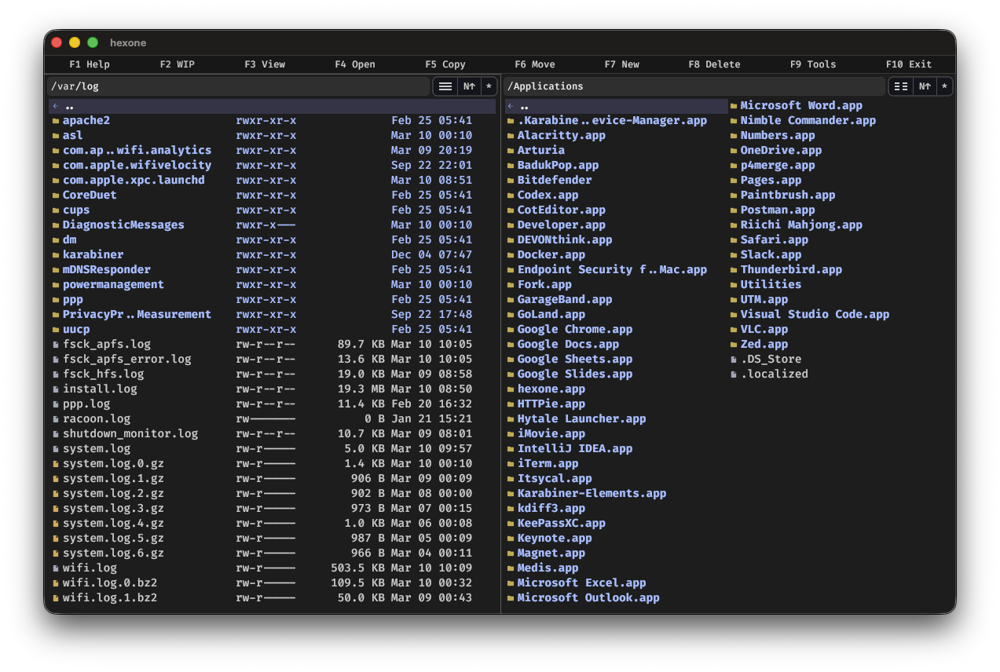
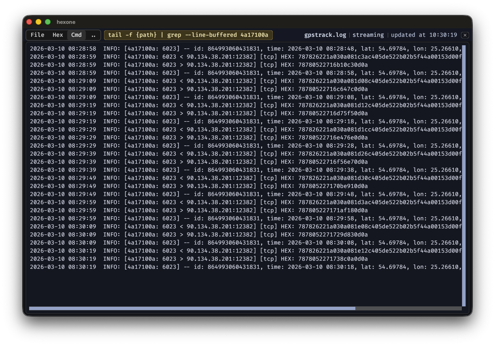

# Hexone

A fast, keyboard-driven file manager with a built-in viewer — browse, inspect, and compare files without leaving the app.

<p align="center">
  
</p>

## What it does

Hexone keeps you in flow. Select a file and press `F3` — the viewer opens instantly on the right. Switch files, the viewer follows. Navigate with the keyboard. Copy, move, rename, delete — all without touching the mouse.

The viewer handles text, syntax-highlighted code, hex dumps, images, PDFs, and binary files. It can also run a custom command and show the output, so you can pipe any tool's result into the same panel.

<p align="center">
  
</p>

## Highlights

**Browse**
- Dual-pane layout — one pane for source, one for destination, or use both independently
- `brief` and `full` listing modes
- Sort by name, date, extension, or size — flip direction with a single click
- Favorites for instant access to frequent locations
- Drive picker on Windows

**View**
- Text with syntax highlighting, hex dump, image preview, and PDF preview in one viewer
- Large file friendly — opening a multi-GB log won't stall the app
- Built-in search with `Ctrl+F`

**Work remotely**
- SSH / SFTP browsing — navigate a remote server the same way as local files
- Viewer works over SSH too

**Extras**
- Hex-to-ASCII converter
- Protocol analyzer driven by a `protocols.yaml` file you can customize

## Install

Download a package from the [Releases](../../releases) page for macOS, Linux, or Windows — no installer needed, just run it.

> [!NOTE]
> **macOS** — if the first launch is blocked, go to `System Settings → Privacy & Security`, scroll to Security, and click **Open Anyway**. This is standard macOS gatekeeper behaviour for apps distributed outside the App Store.

> [!NOTE]
> **Windows** — if SmartScreen shows a blue warning, click **More info → Run anyway**. This happens with new unsigned executables; it is not specific to Hexone.

## Keyboard quick-reference

| Key | Action |
|-----|--------|
| `F1` | Help |
| `F2` | Custom commands |
| `F3` | Open viewer |
| `F4` | Open with system default app |
| `F5` | Copy |
| `F6` | Move / Rename |
| `F7` | New folder |
| `F8` | Delete |
| `F12` | Toggle terminal drawer |
| `Tab` | Switch pane |
| `Shift+Tab` | Toggle terminal/file-pane focus when the terminal drawer is open |
| `Enter` | Open file or directory |
| `Ctrl+F` | Find in viewer |
| `Esc` | Close popup / cancel |

Full keyboard reference is in [HELP.md](HELP.md).

## Build from source

Requires Go 1.26.

```sh
make build
make run
```

## Config files

Hexone keeps its settings in:

- **Linux** — `~/.config/hexone/`
- **macOS** — `~/Library/Application Support/hexone/`
- **Windows** — same folder as the executable

The main config file is `hexone.yaml`. It is created with defaults on first run.

## License

Apache 2.0 — see [LICENSE](LICENSE).
