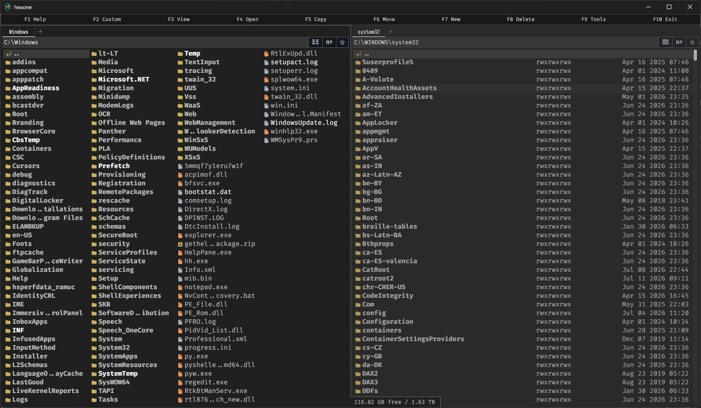
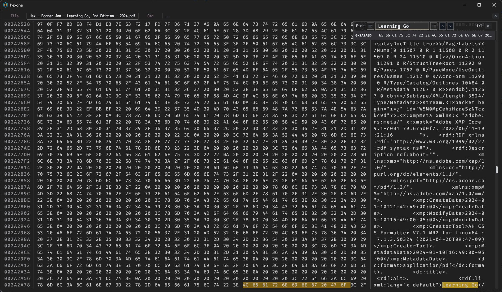
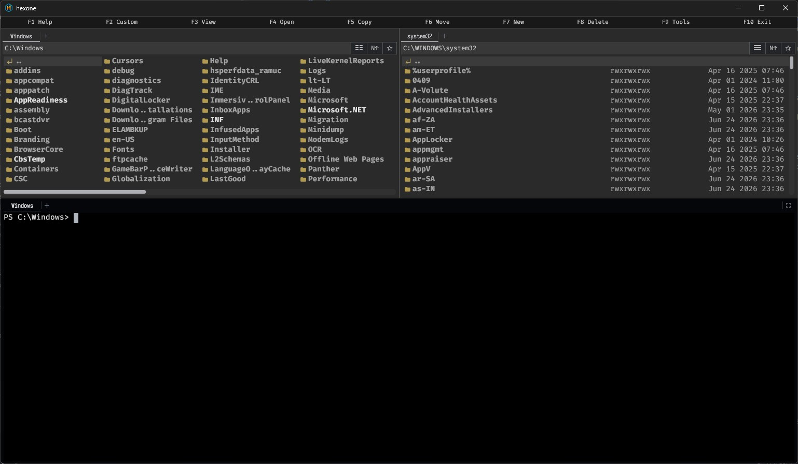
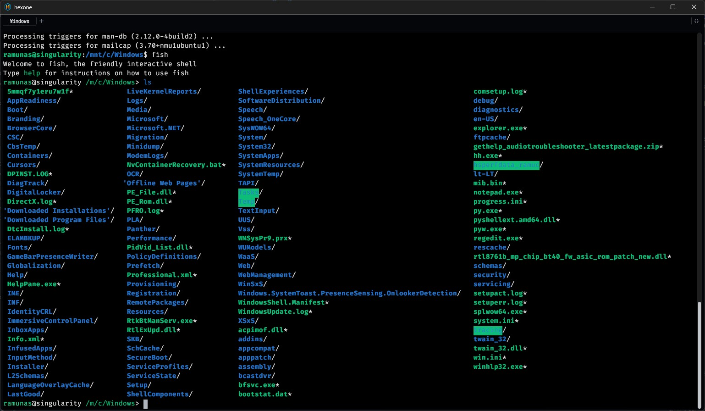

# Hexone

A fast dual-pane file manager for Windows, macOS, and Linux, with SSH/SFTP, an integrated terminal, and a built-in viewer.

<p align="center">
  
</p>

## Features

- Dual file panes with tabs, sorting, favorites, and multi-file rename
- Built-in text, code, hex, image, and PDF viewer with search
- SSH/SFTP browsing with remote file viewing
- Integrated terminal with multiple tabs
- Large-file viewing for logs and binary data
- Hex-to-ASCII and configurable protocol-analysis tools
- Built-in HTTP client with local YAML collections and environments

<p align="center">
  
  
</p>

<p align="center">
  
  
</p>

## Install

### Windows

**Recommended — Microsoft Store:** [Get Hexone from Microsoft Store](https://apps.microsoft.com/detail/9NRFGTN6VGQK) or [open it directly in the Microsoft Store app](ms-windows-store://pdp/?productid=9NRFGTN6VGQK).

Store ID: `9NRFGTN6VGQK`

The Store version provides the simplest installation and automatic updates.

**Alternative — portable build:** Download it from [Releases](../../releases). When SmartScreen warns about the portable build, click **More info → Run anyway**.

### macOS

Download the macOS build from [Releases](../../releases) and move `hexone.app` to Applications. macOS will block the first launch because the app is not notarized. Use either option below to open it.

**Option 1 — Terminal**

Run:

```sh
xattr -cr /Applications/hexone.app
```

Open Hexone normally.

**Option 2 — Open Anyway**

Try opening Hexone once. In the warning that Apple cannot check it for malicious software, click **Done** — not **Move to Trash**. Then go to **System Settings → Privacy & Security**, scroll down, and click **Open Anyway**. When the warning appears again, click **Open**.

### Linux

Download the Linux package from [Releases](../../releases), make it executable if needed, and run it.

## Keyboard quick-reference

| Key | Action |
|-----|--------|
| `F1` | Help |
| `F2` | Custom commands |
| `F3` | Open viewer |
| `F4` | Open with the system default app |
| `F5` / `F6` | Copy / Move or rename |
| `Ctrl+M` / `Cmd+M` | Multi-rename selected files |
| `F7` / `F8` | New folder / Delete |
| `F12` | Toggle terminal |
| `Tab` | Switch pane |
| `Ctrl+N` / `Ctrl+X` | Open / Close tab |
| `Ctrl+F` / `Cmd+F` | Open SSH setup in file panes / Find in viewer |

Full keyboard reference is in [HELP.md](HELP.md).

## Build from source

Requires Go 1.26.

```sh
make build
make run
```

## Config files

Hexone keeps its settings in:

- **Linux** — `~/.config/hexone/`
- **macOS** — `~/Library/Application Support/hexone/`
- **Windows portable** — same folder as the executable
- **Windows MSIX** — the package's `LocalState` folder under `%LOCALAPPDATA%\Packages\`

The main config file is `hexone.yaml`; Hexone creates it on first run. HTTP client collections and environments are stored separately in `hexone-http.yaml`. SSH passwords and key passphrases are stored in the operating system's secure credential store.

## License

Apache 2.0 — see [LICENSE](LICENSE).

## Privacy

Hexone does not include telemetry, analytics, advertising, or publisher-operated cloud services. See the [Privacy Policy](PRIVACY.md) for details about local data and SSH/SFTP connections.
